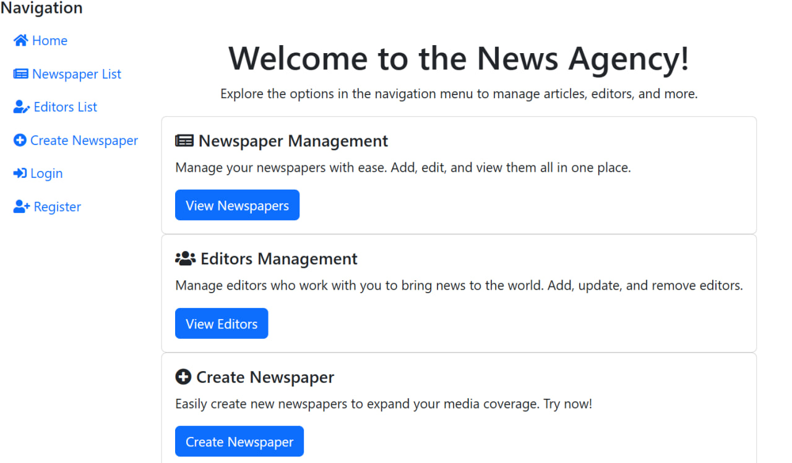

# News Agency Project

This project is built to track newspapers and the editors responsible for each publication. 
It is implemented using **Django 4.1**.

## Features

- **Newspapers Management:** Store and display details of newspapers, 
- including topics and their respective editors.
- **Editors Management:** Manage editor profiles, 
- including experience and associated newspapers.
- **Authentication:** Users can register, log in, 
- and access content based on their roles (admin, editor).
- **Responsive Design:** Built using **Bootstrap**,
- ensuring the platform is accessible on both desktop and mobile devices.

## Check it out

[News Agency Project deployed to Render](https://django-news-agency.render.com/)

## Installation

Python3 must be already installed

```shell 
git clone https://github.com/yulia-pl/django-news-agency.git
cd django-news-agency
python -m venv venv
venv\Scripts\activate (on Windows)
source venv/bin/activate (on macOS)
pip install -r requirements.txt
python manage.py runserver # starts Django Server
```
## Demo


